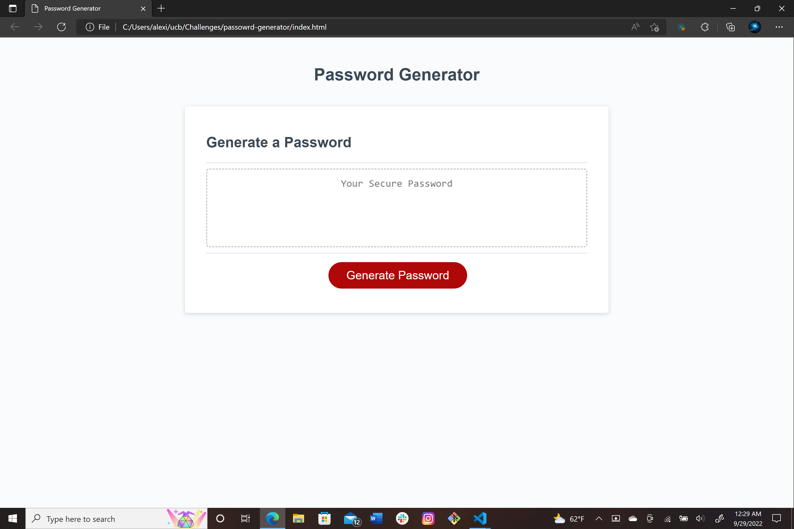

# Password Generator

## Description

This project was created to randomly generate a passowrd according to the user's criteria.
It uses functions and variables in JavaScript so that the webpage executes the correct prompts for the user.

## [Webpage](https://turtle2001.github.io/password-generator/)


## Code Snippet
```JavaScript
function generatePassword(numChar, symbols, number, lower, upper) {
  //makes string of allowed characters
  var allowedChars = "";

  //stores password
  var pw = "";

  //adds characters to string if they were included
  if (symbols)
    allowedChars += " !\"#$ %& '()*+,-./:;<=>?@[\]^_`{|}~";
  if (number)
    allowedChars += "0123456789";
  if (lower)
    allowedChars += "abcdefghijklmnopqrstuvwxyz";
  if (upper)
    allowedChars += "ABCDEFGHIJKLMNOPQRSTUVWXYZ";

  //chooses random character for  each index of pw
  for (i = 0; i < numChar; i++)
    pw += allowedChars.charAt(Math.floor(Math.random() * allowedChars.length));

  return pw;
}
```

## Author Links
[LinkedIn](https://www.linkedin.com/in/alexis-zaragoza-5baa51242/)
[GitHub](https://github.com/turtle2001)